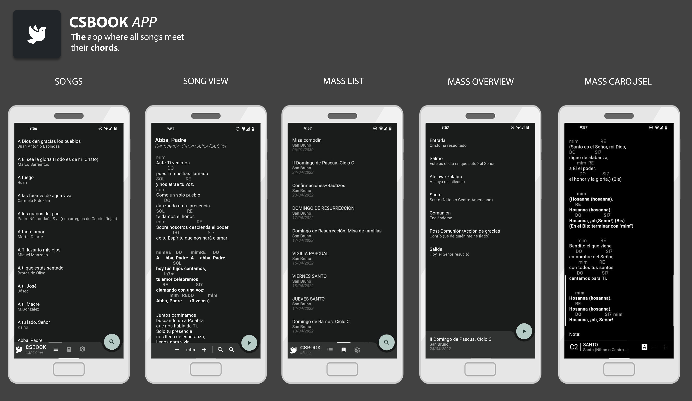

[Flutter](https://flutter.dev) app for [csbook](https://parroquias.csbook.es). 

## Features
With this app you will have the ability to see the latests songs for your sunday service. There is a _"Songs"_ section where you can check the songs individually, change the chords, the font size, etc... but also when you are ready, by clicking the _Play_ button, the screen will become black-backgrounded (AMOLED friendly) and the screen will stay always on so that you can play it with the guitar withouth the annoyance of constantly be touching the display.

There is also a _"Masses"_ section. Any [mass](https://parroquias.csbook.es/masses) from the portal will appear here. By entering into the mass, you will be presented with an overview of the songs meant to be played, and the moment where they should be played, you can click them individually, or you can hit the _Play_ button again so that a carousel will be presented.

## Download
Head to [releases](https://github.com/hkfuertes/csbook_app/releases) to grab the latest APK.

## TO DO:
- SQLite cache song list.
- Custom mass screen with parish preferences
- Songbook index in mass song list
